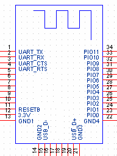
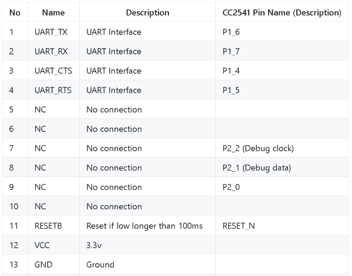
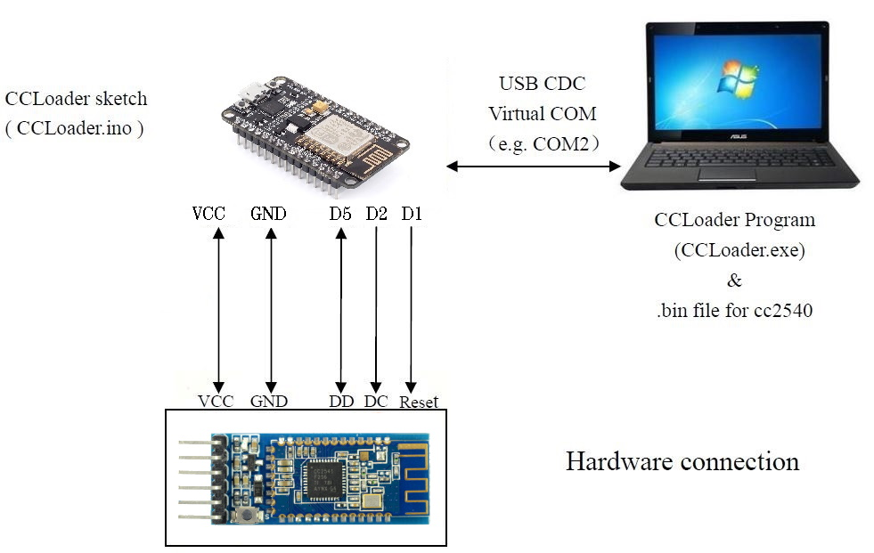

CCLoader
========

Burn CC25xx/HM10 firmware using a NodeMCU or Wemos D1 mini.

Flashing CC2530 or CC2531
==========================
Use the files provided in folder [`Bin`](/Bin) The Hex files are already converted and ready to flash via CCLoader 
More [Zigbee](https://www.zigbee2mqtt.io/information/alternative_flashing_methods.html) infos.

Flashing HM10 (CC2541) or CC2540
==========================
1. Load the already compiled [CCLoader Arduino firmware](/Bin/CCLoader_Arduino.bin) to the MCU board.

  
  
  
2. Wire the pins:  
  - DD (DEBUG_DATA Pin 8) to GPIO14 (D5 on NodeMCU/WeMos D1 Mini)  
  - DC (DEBUG_CLOCK Pin 7) to GPIO4 (D2 on NodeMCU/WeMos D1 Mini)  
  - RESET (RESET_N Pin 11) to GPIO5 (D1 on NodeMCU/WeMos D1 Mini)  
  - GND (Pin 13) to GND  
  - VCC (Pin 12) to 3.3V  

  
3. Use CCLoader.exe to load the [CC2541hm10v707.bin](/Bin/CC2541hm10v707.bin) to burn the firmware via the NodeMCU to the HM-10  
   `CCLoader_x86_64.exe [Number of the COM port] CC2541hm10v707.bin 0`  
4. [Help Video](https://www.youtube.com/watch?v=ez3491-v8Og&lc=z23dzv5wvxrkghouvacdp43beqjns0ivud2tbkcab1xw03c010c.1542030938199060)  
5. Up- and Downgrade to other firmwares you can do with [Manufacturer upgrade tool](http://www.jnhuamao.cn/download_rom_en.asp?id=).  
[More Info](https://forum.arduino.cc/index.php?topic=393655.0)   

