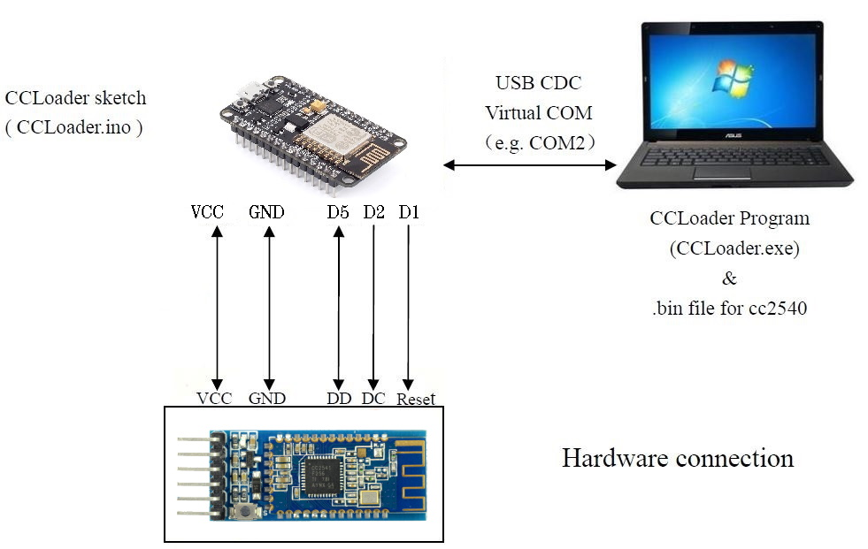
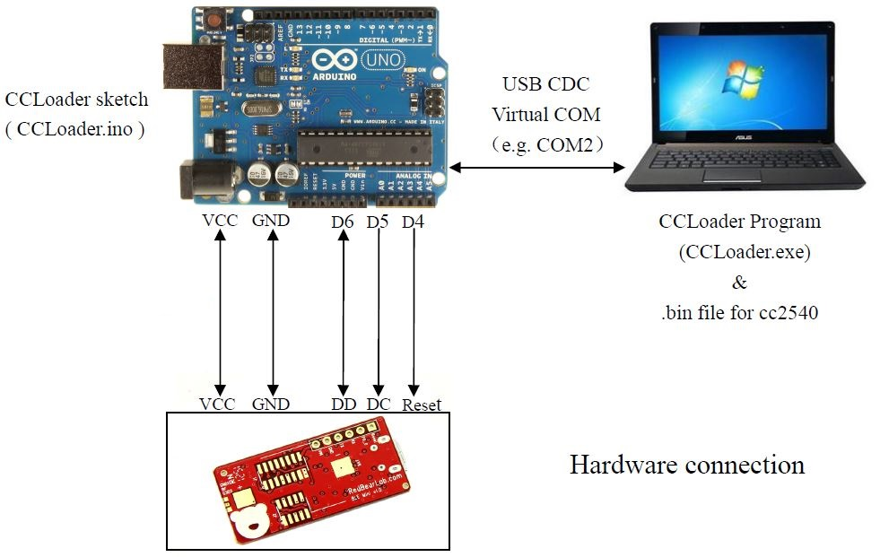

CCLoader
========

Burn CC25xx/HM10 firmware using an Arduino, NodeMCU or Wemos D1 mini.

Flashing CC2530 or CC2531
==========================
Use the files provided in folder [`./firmware`](./firmware). The BIN files are already converted and ready to flash with CCLoader 
Detailed [Zigbee flashing](https://zigbee.blakadder.com/flashing_ccloader.html) information. Thx @blakadder

Flashing HM10 (CC2541) or CC2540
==========================

1. Wire the pins:

    | Pin Name | Pin# | Arduino Pin | NodeMCU/Wemos Pin | GPIO# |
    | --- | --- | --- | --- | --- |  
    | P2_1 (DD, DEBUG_DATA) | Pin #8 | D6  | D5 | GPIO14 |
    | P2_2 (DC, DEBUG_CLOCK) | Pin #7 | D5 | D2 | GPIO4 |
    | RSTB (RESET_N)| Pin #11 | D4 | D1 | GPIO5 |
    | 3.3V | Pin #12 | 3.3V | |  
    | GND | Pin #13 | GND | |

    

    

    **NodeMCU/Wemos** 
    
    **Arduino** 
    

2. Upload [`./CCLoader/src/CCLoader.ino`](CCLoader/src/CCLoader.ino) sketch into your Arduino/NodeMCU

3. Use CCLoader executable to load the [`./firmware/CC2541hm10v707.bin`](./firmware/CC2541hm10v707.bin) firmware via the Arduino/NodeMCU to the HM-10 with command: 
    _Windows_: 
    `CCLoader_x86_64.exe [Number of the COM port] CC2541hm10v707.bin 0`  
    _MacOS_: 
    `CCLoader [device path /dev/cu.xxxx] CC2541hm10v707.bin`  

    (Note: on MacOS/Linux use `ls /dev/cu.*` to find the port name)

4. You should see a result similar to

    

5. Starting with v540, HM10 firmware also supports upgrading via Serial interface. Once you've flashed an HM10 firmware >v540 simply use `AT+SBLUP` to put the device in upgrade mode and  [`./HowTo_Upgrade_Firmware_after_flash/HMSoft.exe`](HowTo_Upgrade_Firmware_after_flash/HMSoft.exe) to upload the firmware. For details see [`./HowTo_Upgrade_Firmware_after_flash/HowToUpgradeFirmware_en.pdf`](./HowTo_Upgrade_Firmware_after_flash/HowToUpgradeFirmware_en.pdf)

### Troubleshooting
If you're not sure the flash succeeded connect to HM-10 module over serial and issue `AT+VERR` commands which should show `v707`.

If you cannot communicate with the HM-10 module even after a successful firmware flash change you serial terminal baudrate to 9600, then issue `AT+RENEW` command which should reset the module to firmware factory settings and the proper 115200 baudrate.

[Help Video](https://www.youtube.com/watch?v=ez3491-v8Og&lc=z23dzv5wvxrkghouvacdp43beqjns0ivud2tbkcab1xw03c010c.1542030938199060)  

[Jinan Huamao Manufacturer downloads](http://www.jnhuamao.cn/download_rom_en.asp?id=)

### More Information

https://forum.arduino.cc/index.php?topic=393655.0   

https://circuitdigest.com/microcontroller-projects/how-to-flash-the-firmware-on-cloned-hm-10-ble-module-using-arduino-uno 

http://www.martyncurrey.com/hm-10-bluetooth-4ble-modules/#HM-10%20scan
