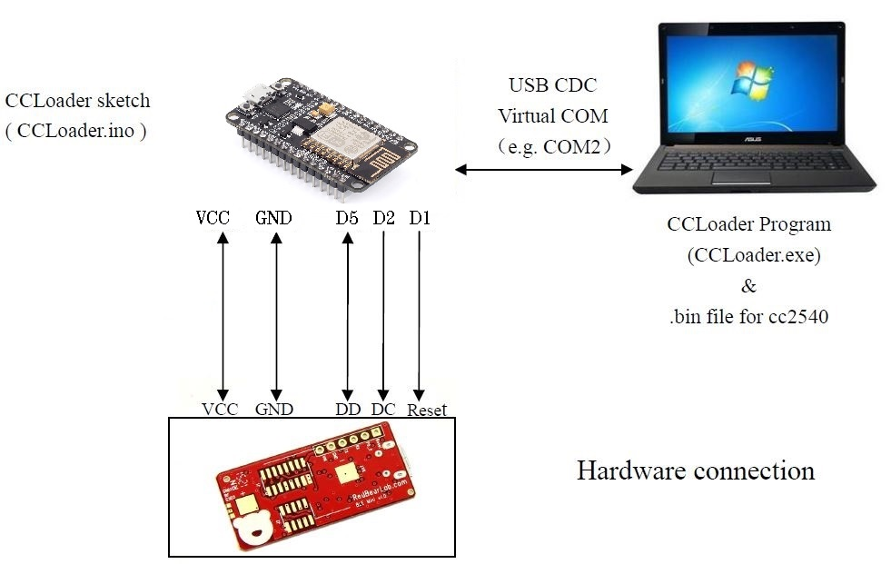

CCLoader
========

Burn CC254x firmware using an NodeMCU board.

1. Load the CCLoader Arduino sketch to the MCU board.
2. Wire the pins:

DD = 14   GPIO14=D5 on NodeMCU/WeMos D1 Mini
DC = 4    GPIO4=D2 on NodeMCU/WeMos D1 Mini
RESET = 5 GPIO5=D1 on NodeMCU/WeMos D1 Mini
LED = 2   GPIO2=D4 Blue LED on the WeMos D1 Mini and the ESP-12E module on the NodeMCU

  
3. Use CCLoader.exe to load the CC2541hm10v540.bin to the MCU board and the board will burn the firmware to the BLE Mini.
4. Video to help [Link](https://www.youtube.com/watch?v=ez3491-v8Og&lc=z23dzv5wvxrkghouvacdp43beqjns0ivud2tbkcab1xw03c010c.1542030938199060)
